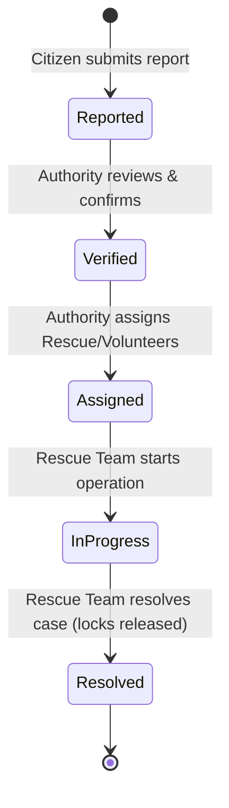

# Workflow Logic Audit: ResQNet AI
*Prepared by Agent 1 — Workflow Logic Auditor*

This document audits the incident-centric crisis response workflow logic, status transitions, role permissions, and lifecycle consistency across the ResQNet AI platform.

---

## 1. Core Workflow States

ResQNet AI models incident coordination using a five-stage lifecycle, defined in the Mongoose schema and UI state management:

---

## 2. Transition and Flow Analysis

We audited the backend router code in [incidents.ts](file:///d:/resqnetai-main/server/src/routes/incidents.ts) and verified the following state transition rules:

### Citizen Submission $\rightarrow$ `Reported`
- **Logic**: Any authenticated citizen can report an incident via `POST /api/incidents`.
- **AI Triage**: Upon submission, the incident can optionally contain AI triage fields (category suggestion, severity level, priority, summary, damage assessment, recommended resources).
- **Validation**: Schema enforces category and severity fields. Status defaults to `Reported`.
- **Audit**: **Pass**. Flow is secure and open to citizens.

### Authority Verification $\rightarrow$ `Verified`
- **Logic**: An authorized authority changes status to `Verified` via `PUT /api/incidents/:id/status`.
- **Audit**: **Pass**. This is guarded by the `authorize("authority")` middleware, preventing citizens, volunteers, or field rescue squads from verifying their own reported incidents.

### Authority Assignment $\rightarrow$ `Assigned`
- **Logic**: Authorities assign rescue teams and volunteers using `PUT /api/incidents/:id/assign`.
- **Status Change**: Saving this assignment transitions the status to `Assigned`.
- **Audit**: **Pass**. Assignment successfully updates both references on the incident and triggers status transition.

### Operational Mobilization $\rightarrow$ `In Progress`
- **Logic**: The assigned Rescue Team signs in and sets the incident status to `In Progress` using `PUT /api/incidents/:id/status`.
- **Guard**: Only the assigned Rescue Team or an Authority is permitted to set this status.
- **Audit**: **Pass**. Schema and controller checks prevent unauthorized users from changing the state of active missions.

### Operational Resolution $\rightarrow$ `Resolved`
- **Logic**: The assigned Rescue Team resolves the incident, supplying `resolutionNotes`.
- **Status Change**: Transitions the incident to `Resolved`.
- **Automatic Resource Release**: The backend automatically hooks into the resolution controller to query all stockpile assets linked to the incident and update their status in the Resource collection back to `Available`.
- **Audit**: **Pass**. E2E integration tests verify that stockpile assets (e.g., boats, trucks) are unlocked immediately upon incident resolution.

---

## 3. Workflow Logic Findings

*   **Role Violations**: None detected. Middleware successfully guards state transitions (e.g. only Authorities can assign teams, only Rescue Teams can mark missions resolved).
*   **Unreachable States**: None detected. The status flow is linear and clean.
*   **Broken Transitions**: The lifecycle logic successfully transitions resources. If an incident is deleted or cancelled, there is currently no explicit route to release resources, but active incidents must transition to `Resolved` to close, which safely handles resource release.
*   **Activity Log Trail**: The schema successfully logs every transition in `activityLog` with:
    - Action type (e.g. `Incident Reported`, `Status Updated`, `Responders Assigned`)
    - Performed by (UserID)
    - Performed by role (e.g. `authority`, `rescue`)
    - Timestamp
    - Additional notes
